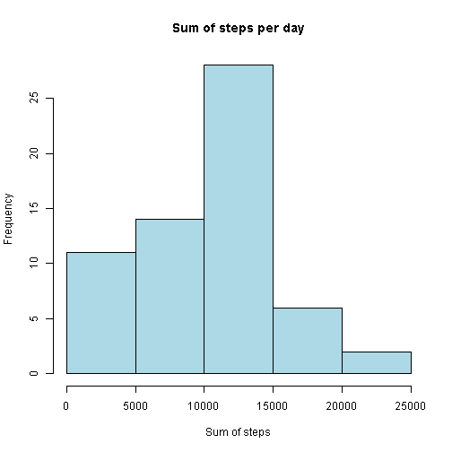

## Loading and preprocessing the data


```r
data1 <- read.csv("activity.csv")
```

##  What is mean total number of steps taken per day?

- Total steps per day

```r
TotalStepsPerDay1 <- tapply(data1$steps, data1$date, sum, na.rm = TRUE)
```

- Histogram of the total number of steps taken each day

```r
hist(TotalStepsPerDay1, breaks =  ,col = "lightblue", main = "Sum of steps per day",
 xlab = "Sum of steps", ylab = "Frequency")
```

 

- Mean steps per day:

```r
MeanStepsPerDay1 <- mean(TotalStepsPerDay1)
MeanStepsPerDay1
```

```
## [1] 9354.23
```

- Median steps per day:

```r
MedianStepsPerDay1 <- median(TotalStepsPerDay1)
MedianStepsPerDay1
```

```
## [1] 10395
```

## What is the average daily activity pattern?

- Time series plot of the 5-minute interval and the average number of steps taken,
averaged across all days (y-axis)

```r
AverageStepsPerInterval1 <- tapply(data1$steps,data1$interval, mean, na.rm = TRUE)
data1$interval <- as.factor(data1$interval)
IntervalLevels <- levels(data1$interval)
plot(IntervalLevels, AverageStepsPerInterval1,  type="l", main = "Average steps per interval",
 xlab= "interval", ylab= "steps", col="green" , lwd=2)
```

 

- Interval containing the maximum number of steps (average across all the days)

```r
names(which.max(AverageStepsPerInterval1))
```

```
## [1] "835"
```

## Imputing missing values 

- Calculation of rows with missing values

```r
CompleteRows1 <- complete.cases(data1)
NumberofNARows1 <- length(CompleteRows1[CompleteRows1==FALSE])
NumberofNARows1
```

```
## [1] 2304
```

- I will use "mice" package for imputing missing values based on rest of data. 

```r
library(mice) 
set.seed(1)  
vars.for.imputation = names(data1)
data2 = complete(mice(data1[vars.for.imputation]))
```

- Total steps per day

```r
TotalStepsPerDay2 <- tapply(data2$steps, data2$date, sum)
```

- Histogram of the total number of steps taken each day

```r
hist(TotalStepsPerDay2, breaks =  ,col = "lightblue", main = "Sum of steps per day",
 xlab = "Sum of steps", ylab = "Frequency")
```

 

- Mean steps per day:

```r
MeanStepsPerDay2 <- mean(TotalStepsPerDay2)
MeanStepsPerDay2
```

```
## [1] 9940.836
```

- Median steps per day:

```r
MedianStepsPerDay2 <- median(TotalStepsPerDay2)
MedianStepsPerDay2
```

```
## [1] 10395
```

- Difference in means (data with imputed values minus original data):


```r
MeanStepsDifference <- MeanStepsPerDay2 - MeanStepsPerDay1
MeanStepsDifference
```

```
## [1] 586.6066
```

- Difference in medians (data with imputed values minus original data):


```r
MedianStepsDifference <- MedianStepsPerDay2 - MedianStepsPerDay1
MedianStepsDifference
```

```
## [1] 0
```

##  Are there differences in activity patterns between weekdays and weekends?

- Creating a new factor variable in the dataset with two levels - "weekday" and "weekend" 

```r
library("chron")
for (i in 1:nrow(data2)) {
      if(is.weekend(as.Date(data2$date[i]))) {
            data2$DayType[i] <- "weekend"      
      } else {
            data2$DayType[i] <- "weekday"       
      }
}
data2$DayType <- as.factor(data2$DayType)
```

- Making a panel plot containing a time series plot of the 5-minute interval (x-axis) and the average number of steps taken, averaged across all weekday days or weekend days (y-axis). 

```r
library(lattice)
data3 <- aggregate(steps ~ interval + DayType, data = data2, mean)
xyplot(steps ~ interval | DayType, data3, type = "l", layout = c(1, 2), 
       main = "Average steps for weekdays and weekend", xlab = "interval", ylab = "steps")
```

 

